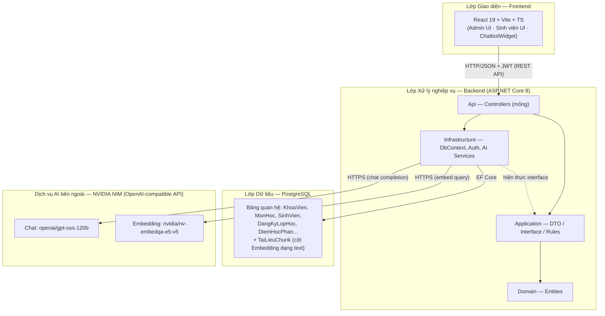
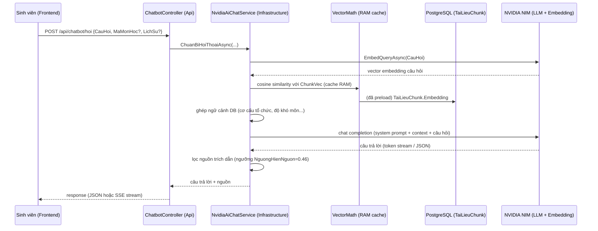

# Sơ đồ kiến trúc hệ thống — QuanLyTruongHoc (VMU)

> Vẽ lại theo kiến trúc **thực tế đang triển khai** trong repo (xem [ARCHITECTURE.md](ARCHITECTURE.md)):
> **3 tầng (Frontend / Backend / Database) + tích hợp AI bên ngoài qua API**, không phải 4 lớp ngang hàng độc lập.

## 1. Sơ đồ tổng quan

## 2. Luồng xử lý chatbot RAG (chi tiết)

## 3. Đối chiếu với mô tả "4 lớp"

| Mô tả 4 lớp (báo cáo) | Thực tế trong repo |
|---|---|
| Lớp Giao diện (Frontend) | ✅ Đúng — React gọi REST API qua `services/*` (axios), đính JWT |
| Lớp Xử lý nghiệp vụ (Backend) | ✅ Đúng — ASP.NET Core, layered Api→Application→Domain, Infrastructure hiện thực |
| Lớp Dữ liệu (quan hệ + vector riêng) | ⚠️ PostgreSQL chứa **cả hai trong cùng schema quan hệ** — không có vector DB tách biệt; cosine similarity tính trong RAM ở Backend, không phải trong DB |
| Lớp Trí tuệ nhân tạo (AI Engine riêng) | ⚠️ Không phải layer tự vận hành — là **dịch vụ ngoài** (NVIDIA NIM) được gọi từ tầng Infrastructure của Backend qua HTTPS |

**Kết luận**: nên trình bày là **"3 tầng + tích hợp AI ngoài"** thay vì 4 lớp ngang hàng, để khớp với cách hệ thống được triển khai thực tế.
